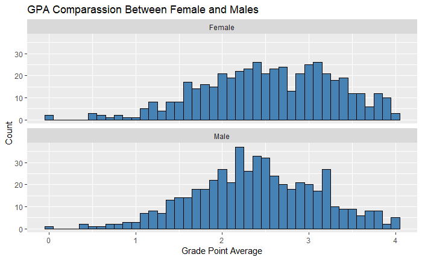
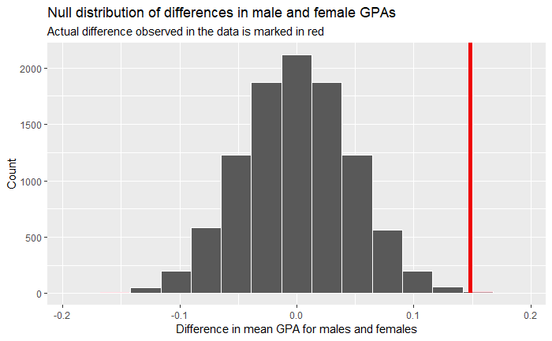
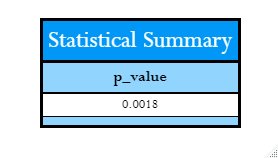
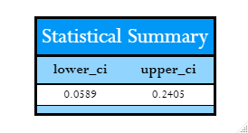

# GPA Hypothesis Testing

## Data

Dataset of some grade-point-average (GPA) data for college freshman.

Each row or case in this data frame is a student. The data includes:

 - the (binary) gender of each student
 - the math, verbal and total SAT scores for each student
 - the GPA range of each student in high school (categorized as "low" or "high")
 - the GPA of each student their first year of college on a numeric scale.

## Example of Hypothesis Testing within R script
 
### Exploratory data analysis 

 
### Hypotheses

$$\begin{aligned} H_0:&\mu_{male} = \mu_{female} \\\ H_A:&\mu_{male} \neq \mu_{female} \end{aligned}$$

*And can be rewritten as the following*
 
$$\begin{aligned} H_0:&\mu_{male} - \mu_{female} = 0 \\\ H_A:& \mu_{male} - \mu_{female} \neq 0 \end{aligned}$$

### Visualization of how the observed difference via Null Distribution permutations

Note that zero is the center of this null distribution. The null hypothesis is that there is no difference between males and females in GPA score when gpa. In the permutations, zero was the most common difference, because observed GPA values were re-assigned to males and females *at random*. Differences as large as ~ 0.1 and -0.1 occurred, but much less frequently, because they are just not as likely when structure is removed from the data. 

### Summary

This result indicates that there is a 0.18% chance (very low) chance that we would see an observed difference of 0.15 [calculated difference between groups] in GPA scores between males and females (or a bigger difference) if in fact there was truly no difference between the sexes in GPA scores in the population. However, the given data shows to have significant difference between groups.

The confidence interval supports the p-value as the interval does not contain 0. One would expect to see an difference between GPA lie within the confidence intervals 95% of the time.
 
### Citation
>This data was collected from the following:
https://rudeboybert.github.io/SDS220/static/PS/sat_gpa.csv
